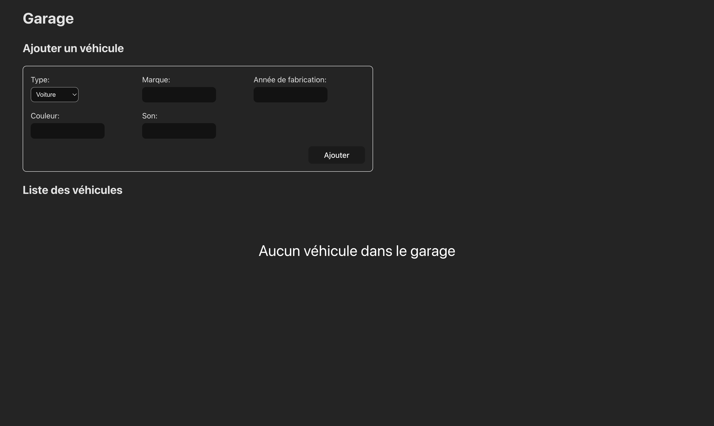
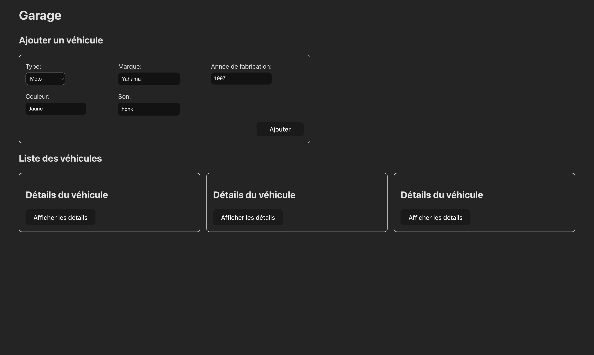
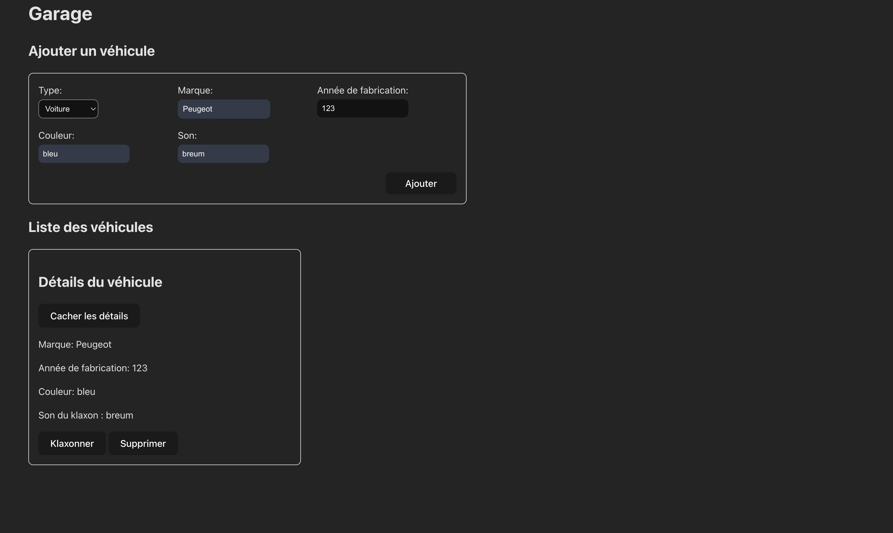
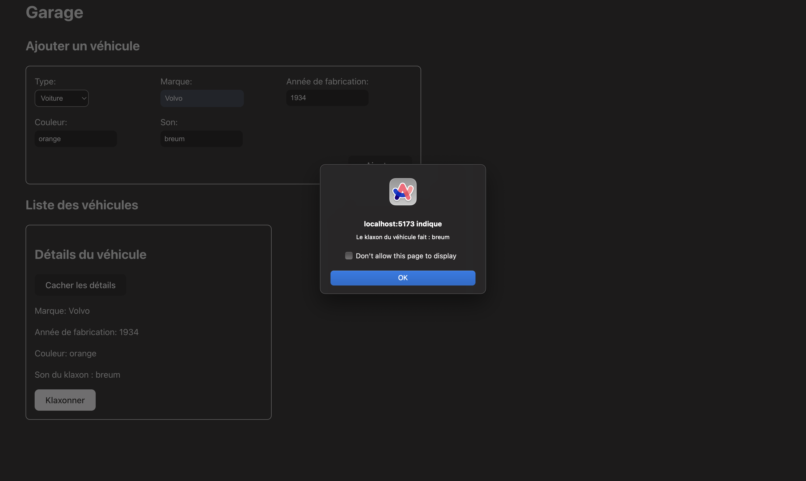

# Garage 

## Explications 

### Description

Garage est une application web permettant de gérer un garage de véhicules. L'application permet d'ajouter des véhicules, de les supprimer, de les modifier et de consulter les détails d'un véhicule.

### Fonctionnement 

L'application est composée de deux composants principaux :

- `Garage` : Composant principal de l'application, il permet d'afficher la liste des véhicules présents dans le garage. Il permet également d'ajouter un véhicule ou de consulter ses détails.

- `Vehicule` : Composant permettant d'afficher les détails d'un véhicule.

## Etat du garage au lancement de l'application

## Etat du garage après l'ajout de véhicules

## Visionnage des détails d'un véhicule

### Alerte lors d'un klaxon

